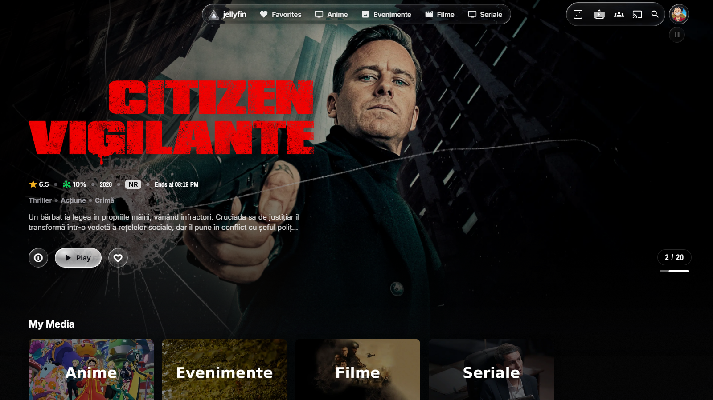
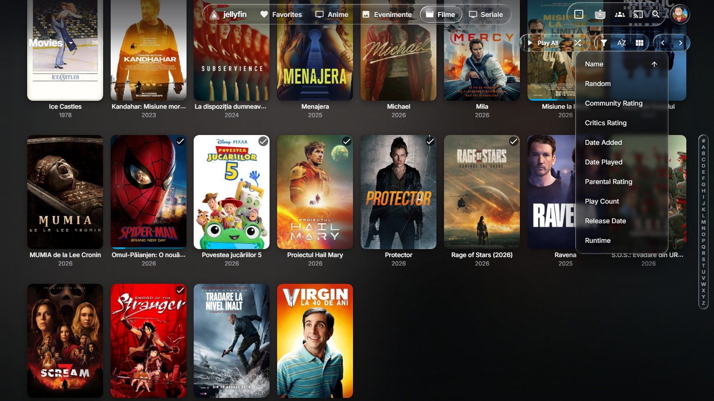
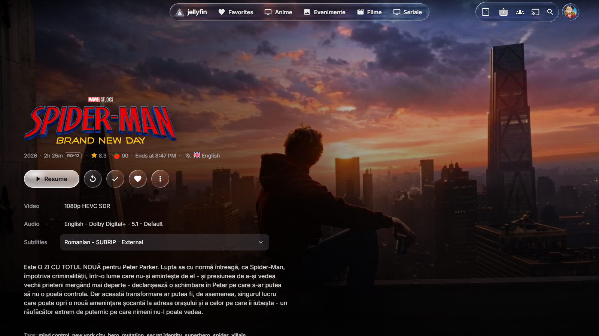
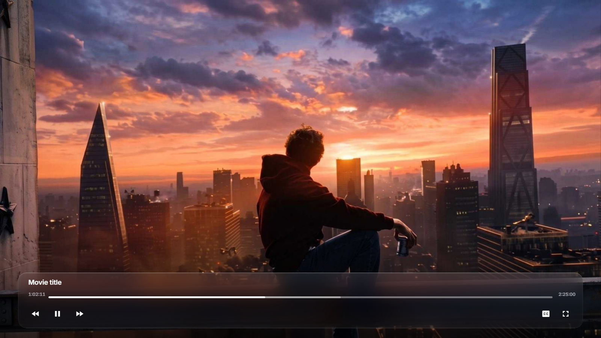
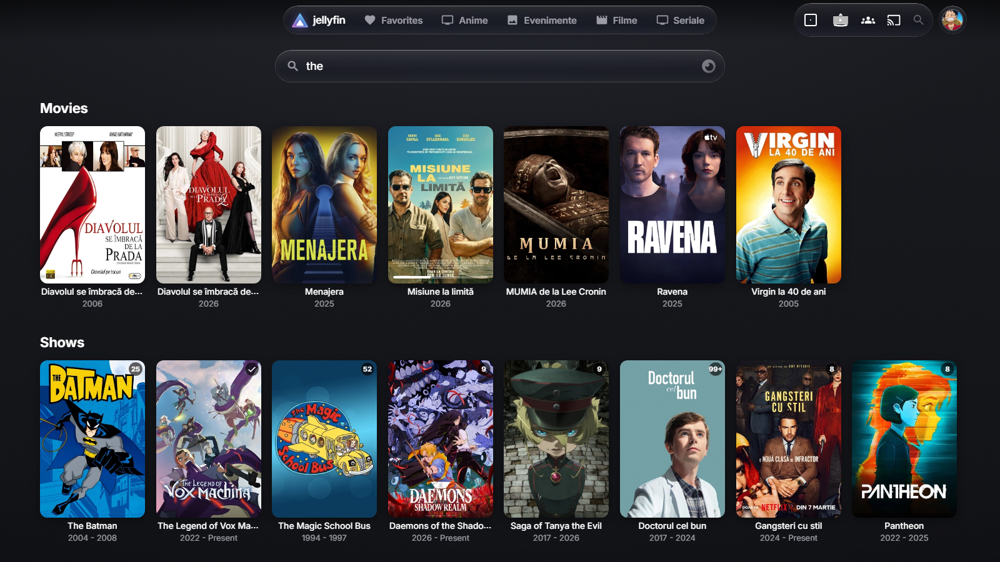

# GlassJelly

**A Liquid Glass theme for Jellyfin 12.** Clear, tinted glass on the floating chrome — header capsules, player
controls, menus, search, dialogs — with a specular rim, a soft sheen and, in Chromium desktop browsers, **real
refraction**: the picture behind each pane bends at its edge like the rim of a glass slab. Graphite canvas, the
current artwork glowing through as an ambient background, white accent like tvOS.



| Library + sort menu | Details |
|---|---|
|  |  |
| **Player** | **Search** |
|  |  |

## Features

- **Liquid Glass materials**: low tint, short blur with boosted saturation, specular rim, top sheen. No opaque bars:
  once you scroll, the header capsules float over the content with a fading "scroll edge", like iOS 26.
- **Refraction lens** (Chrome, Edge, Brave, Opera, Jellyfin Media Player on desktop): an SVG displacement filter built
  from each element's own box, so the rim is the same width on a 44 px button and a full-width player panel.
  Pure CSS, no script. Safari, Firefox, phones and TV boxes get the same glass without the lens.
- **Ambient background**: the current backdrop, tiny and blurred, behind the whole UI (details pages, Media Bar slides).
- **Player**: a floating glass control panel that actually blurs the video (Jellyfin's own `will-change` used to cut it
  off), Skip Intro / Recap docked into the panel.
- **Everything themed**: home, libraries, details, search, menus and action sheets, dialogs, login, settings, the
  admin dashboard, iOS-style switches. Styles the Media Bar Enhanced, Home Screen Sections and Jellyfin Enhanced plugins
  when you have them.
- **Liquid hover**: whatever is under the mouse — tabs, header icons, buttons, menu rows — becomes a droplet of
  brighter glass lit from the cursor, posters get a glass rim and a highlight that follows the pointer.
- **Jelly press**: glass buttons squash a little when pressed and spring back.
- **Accessible**: honours *Reduce transparency* (solid materials) and *Reduce motion*.
- **Fast**: glass only on single, large surfaces — never on the hundreds of per-card buttons (each blurred element is a
  GPU layer).

## Requirements

- **Jellyfin 12.x** (web client). Older versions have a different header and are not supported.
- Optional, for the full theme: the **File Transformation** plugin
  (repository `https://www.iamparadox.dev/jellyfin/plugins/manifest.json`). Without it you get the CSS-only theme:
  no ambient artwork background, stock admin dashboard, Skip Intro stays where Jellyfin puts it.

## Install

### Option A — one line of CSS (any server, 30 seconds)

Dashboard → General → **Branding** → **Custom CSS**, paste, **Save**, then reload the page (Ctrl+F5):

```css
@import url("https://cdn.jsdelivr.net/gh/FlorinCamarut1/glassjelly@v2.4.0/dist/glassjelly.css");
```

Keep Jellyfin's own logo and your server name in the header? Use `dist/glassjelly-nologo.css` instead.
Pin a tag (`@v2.4.0`) so an update never surprises you; change it when you want a new version.

### Option B — installer (full theme)

Needs Python 3.8+ on any machine that can reach the server (no extra packages).

```bash
git clone https://github.com/FlorinCamarut1/glassjelly.git
cd glassjelly
python3 install.py --url http://YOUR-SERVER:8096
```

It asks for an administrator login (or pass `--api-key KEY` from Dashboard → API Keys, or set `JF_API_KEY`). It
applies live — no restart — and backs up everything it changes to `./backups`. Run it with `--dry-run` first to see
the changes.

| Option | Effect |
|---|---|
| `--cdn [TAG]` | write the one-line `@import` instead of pasting the whole CSS |
| `--no-logo` | keep Jellyfin's logo + server name, favicon and login background |
| `--no-splash` | keep your own login background |
| `--no-ambient` | no artwork background (graphite canvas only) |
| `--no-dashboard` | leave the admin dashboard stock |
| `--no-skip-dock` | leave Skip Intro where Jellyfin puts it |
| `--no-backdrops-default` | do not switch *Backdrops* on for devices that never chose |
| `--no-hover-light` | hover highlights stay centred (no cursor-following script) |
| `--no-font` | system fonts only (no Inter from jsDelivr) |

**Update**: `git pull && python3 install.py --url ...` (same options). **Remove**: `python3 install.py --uninstall`;
`--restore backups/branding-<date>.json` puts back an exact earlier state.

## Customize

Everything is driven by tokens at the top of the CSS. Override them *after* the `@import` in Custom CSS, with the
same selector the theme uses (`:root, html[data-theme]`) so yours win:

```css
:root, html[data-theme] {
  --gj-mat-thin: rgba(26,26,32,.40);           /* more tint on the capsules */
  --gj-blur-s: blur(14px) saturate(180%);      /* frostier glass */
  --gj-lens: saturate(1); --gj-lens-s: saturate(1);   /* refraction off, glass stays */
  --gj-accent: #0a84ff; --gj-accent-channel: 10 132 255; --gj-on-accent: #fff;   /* blue accent */
}
```

Lite mode (no blur anywhere, for weak devices): `--gj-blur-s: none; --gj-blur-m: none; --gj-blur-l: none;`.

## Browser support

| | Glass | Refraction lens |
|---|---|---|
| Chrome / Edge / Brave / Opera (desktop) | ✓ | ✓ |
| Jellyfin Media Player | ✓ | ✓ |
| Safari (macOS, iOS), Firefox | ✓ | — (plain glass) |
| Phones, tablets, TV boxes (touch) | ✓ (lighter) | — |

## How the lens works

`tools/glassfilter.mjs` builds an SVG filter that is used straight from a `data:` URI in `backdrop-filter`:
the element's box is eroded and blurred into a soft slab, two convolutions turn it into surface normals, and
`feDisplacementMap` shifts the backdrop along them near the rim. Because it is derived from the box itself rather than
from a stretched displacement image, the rim keeps the same width at any size or aspect ratio. Chromium does not clip
`url()` backdrop filters to `border-radius`, so lensed elements also get `clip-path: inset(0 round R)`.

## Development

```bash
node tools/build.mjs     # regenerate the lens tokens in src/, write dist/*.css, run sanity checks
```

`src/glassjelly.css` is the source (sections are numbered; v2 Liquid Glass lives in section 21), `src/js/` holds the
index.html scripts, `src/early.css` the startup-screen CSS. Never put a `$` in a script: File Transformation treats the
replacement text as a regex.

## Credits

Made by [FlorinCamarut1](https://github.com/FlorinCamarut1). The neon triangle logo is a recolour of the Jellyfin logo
(see [jellyfin-ux](https://github.com/jellyfin/jellyfin-ux) for its licence); GlassJelly is not affiliated with the
Jellyfin project. Inter font by Rasmus Andersson (SIL OFL), served by jsDelivr / Fontsource.
Theme code: MIT, see [LICENSE](LICENSE).
